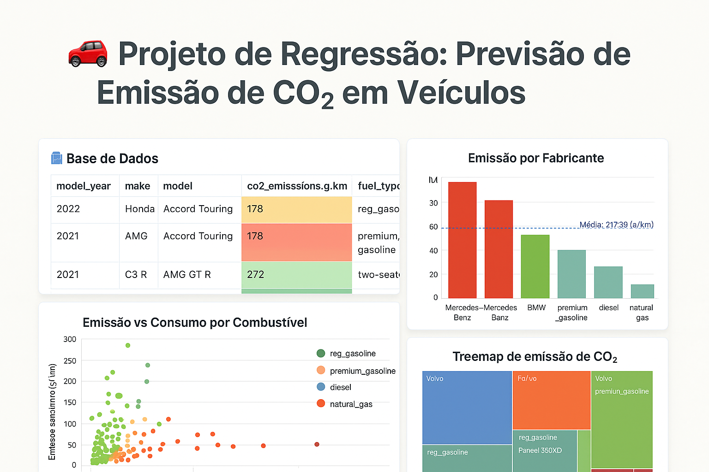

# 🚗 Projeto de Regressão: Previsão de Emissão de CO₂ em Veículos

Este projeto de Ciência de Dados tem como objetivo analisar e prever a emissão de dióxido de carbono (CO₂) com base em dados reais de veículos vendidos no Canadá. A base foi disponibilizada pelo [governo canadense](https://open.canada.ca/data/en/dataset/98f1a129-f628-4ce4-b24d-6f16bf24dd64).

A análise vai desde a exploração inicial dos dados até a criação de uma aplicação interativa com Streamlit para prever emissões de CO₂ com base em características de veículos.



---

## ✨ Destaques do Projeto

- 📊 Análise exploratória completa (EDA)
- 🧹 Limpeza e consolidação dos dados em `.parquet`
- 📖 Entendimento detalhado com dicionário de dados
- 🔍 Comparação de diferentes modelos de regressão
- 🧠 Aplicação do modelo final em uma interface interativa (Streamlit)
- 📁 Organização baseada em boas práticas e reprodutibilidade

---

## 🧠 Etapas Executadas

1. Carregamento e união de diversas bases
2. Criação do dicionário de dados e entendimento coluna a coluna
3. Exportação dos dados tratados e reduzidos (.parquet)
4. EDA com visualizações interativas usando `plotly`
5. Teste de múltiplos modelos de regressão (e.g., Linear, Tree, LGBM)
6. Escolha do melhor modelo com base em métricas (RMSE, R²)
7. Criação da aplicação web interativa com Streamlit

---

## 🗂️ Organização dos Arquivos

├── ambiente.yml <- Requisitos do ambiente Conda
├── notebooks/ <- Jupyter Notebooks com análise e modelagem
├── modelos/ <- Modelos treinados salvos em .joblib
├── dados/ <- Dados originais e consolidados
├── referencias/ <- Dicionário de dados (.md)
├── relatorios/imagens/ <- Gráficos e imagens geradas para README e App
├── home_atualizada.py <- Código do app Streamlit
├── README.md <- Você está aqui!


---

## 🚀 Como Executar Localmente

```bash
# 1. Clone o repositório
https://github.com/SEU_USUARIO/NOME_DO_REPOSITORIO

# 2. Crie o ambiente
conda env create -f ambiente.yml
conda activate nome_do_ambiente

# 3. Rode o app
streamlit run home_atualizada.py


```

## 📈 Exemplo da Aplicação
Acesse visualmente os dados e gere previsões:

📂 Visualize dados filtráveis

## 📉 Gráficos de dispersão, barras e treemaps

🧪 Previsão de CO₂ com base em ano, motor, cilindros, consumo e mais

## 📚 Dicionário de Dados

O dicionário completo pode ser consultado em referencias/01_dicionario_de_dados.md

## 📬 Contato
Everson Rodrigues
em transição para área de dados, com foco em projetos de impacto e aplicações reais.
🔗 LinkedIn

## 📄 Licença
Projeto sob Licença MIT - veja o arquivo LICENSE.
